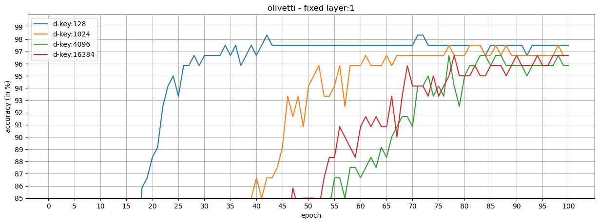
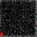
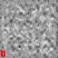

This repository contains the code for *Key Protected Classification for Collaborative Learning*
- [arXiv](https://arxiv.org/abs/1908.10172)
- [elsevier](https://www.sciencedirect.com/science/article/abs/pii/S0031320320301308?via%3Dihub)

The experiments in the paper were implemented in TensorFlow.
We re-implemented them in PyTorch.
While doing that, we also improved the training of participants and generative networks (to make the attack stronger) by adding some heuristics.

# how to
 *src/scripts* folder contains scripts to run experiments for:
- `clf_training.sh` Collaborative learning (CLF) training without any attacker => vanilla and key protected (ours) cases.
  In our experimens we choose a CLF setup which does not involve a protection mechanism to prevent information leakage from participants.
  Concretely:
    - The ratio of parameters uploaded to and downloaded from the parameter server by each participant is 1.
      This means that participants do not employ a routine that filters gradients of some of the parameters, which can be seen as a form of protection.
    - Participants do not add noise to i) the parameters before they upload them to the parameter server, or ii) the gradients computed during training.
      In other words, we do not make use of the *differential privacy* to increase anonymity of participants during training.
  We choose this setup on purpose to maximize the chances of an attacker in our key-protected classification model.
- `gan_attack.sh` CLF with an attacker => vanilla GAN attack and GAN attack in key protected (ours) cases
- `run.sh` An example script that shows how to use these two scripts.

We use torchvision and scikit-learn to handle automatic downloads of the MNIST and Olivetti Faces datasets.
So you don't need to do anything to prepare data.
The code automatically downloads them into `../data/`.
Set the `OUTPUT_ROOT` variables in  `clf_training.sh` and `gan_attack.sh` scripts to the directory where you want the programs save outputs to.

**environment**:
I run `src/requirements.txt` is generated via `conda list -e > requirements.txt`.
See the first two lines of this file to create a new conda environment with all the packages I used to obtain the results belove.

# experiments

### key-protected collaborative learning

We show that our loss formulation and training procedure are useful for collaborative learning frameworks.
For this, we split the classes in MNIST and Olivetti Faces datasets into two *honest* participants, and train shared models.

**Observations**:
- When the *key-protected classification* is configured properly, it is possible to achieve high performance in collaborative frameworks.
- *Fixed layers* can be used in the shared models (at the cost of training the models longer) to reduce the number of trainable parameters while increasing the dimension of class keys.

### mnist - the attacker has the same class key for a class

This setting is the illustration for the extreme case: the attacker is able generate the same class key as one of the class keys generated by the participants => $c_{attack} = c_i$ for any $i$.
To demonstrate this setting, we perform collaborative training where datasets are split into two participants and one of them is an adversary.

- there is NO fixed layer in the shared classification models

| d-key | Digit 0  | Digit 1   | Digit 2   | Digit 3   | Digit 25  |
|-------|----------|-----------| ----------| ----------| ----------|
| 128   |      |      |      |      |      |
| 1024  |    |    |    |    |    |
| 4096  |    |    |    |    |    |
| 16384 |  |  |  |  |  |

- there is A fixed layer in the shared classification models

| d-key | Digit 0  | Digit 1   | Digit 2   | Digit 3   | Digit 25  |
|-------|----------|-----------| ----------| ----------| ----------|
| 128   |      |      |      |      |      |
| 1024  |    |    |    |    |    |
| 4096  |    |    |    |    |    |
| 16384 |  |  |  |  |  |

### mnist - the attacker generates random class keys

| d-key | Without Fixed Layer | With Fixed Layer |
|-------|:-------------------:|:----------------:| 
| 128   |      |      
| 1024  |    |    
| 4096  |    |    
| 16384 |  |  

**Observations**:
- In all cases, the attacker is unable to generate samples representing a particular digit.
- We see that when $d_{key}$ is small, eg. 128, the distribution learned by the generator network resembles the digits.
- However, using high-dimensional keys can alleviate this.

